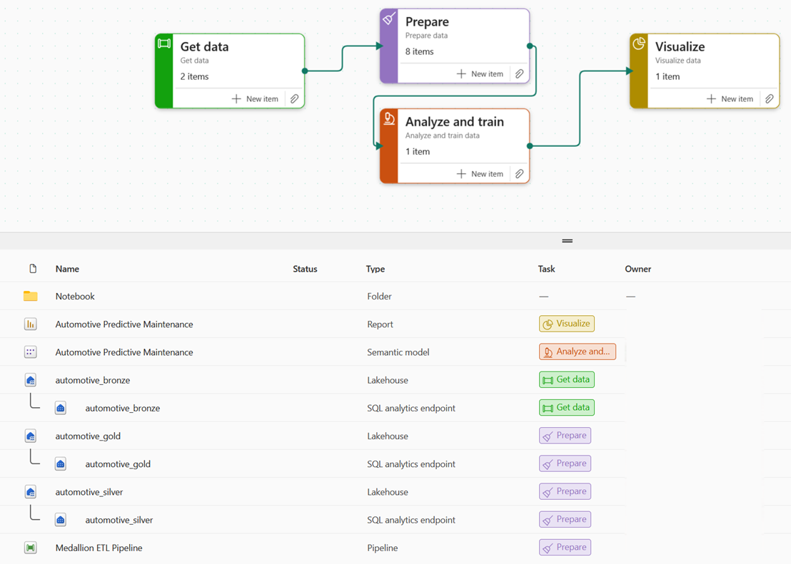

# Fabric Predictive Vehicle Maintenance

End-to-end Predictive Vehicle Maintenance sample on Microsoft Fabric — Medallion Architecture (Bronze → Silver → Gold), import-mode Semantic Model, and Power BI Report deployed from code.

See [FABRIC.md](FABRIC.md) for the full deployment guide.

	

---

## Remote Workspace

| Item | Type | Location |
|------|------|----------|
| `01_bronze_ingest` | Notebook | `Notebook/` folder |
| `02_silver_transform` | Notebook | `Notebook/` folder |
| `03_gold_aggregate` | Notebook | `Notebook/` folder |
| `automotive_bronze` | Lakehouse | root |
| `automotive_silver` | Lakehouse | root |
| `automotive_gold` | Lakehouse | root |
| `Automotive Predictive Maintenance` | SemanticModel | root |
| `Automotive Predictive Maintenance` | Report | root |
| `Medallion ETL Pipeline` | DataPipeline | root |

---

## References

- [Fabric Jumpstart](https://github.com/microsoft/fabric-jumpstart)
- [Fabric Terraform Quickstart](https://github.com/microsoft/fabric-terraform-quickstart)
- [Fabric Toolbox](https://github.com/microsoft/fabric-toolbox)
- [Skills for Fabric](https://github.com/microsoft/skills-for-fabric)
